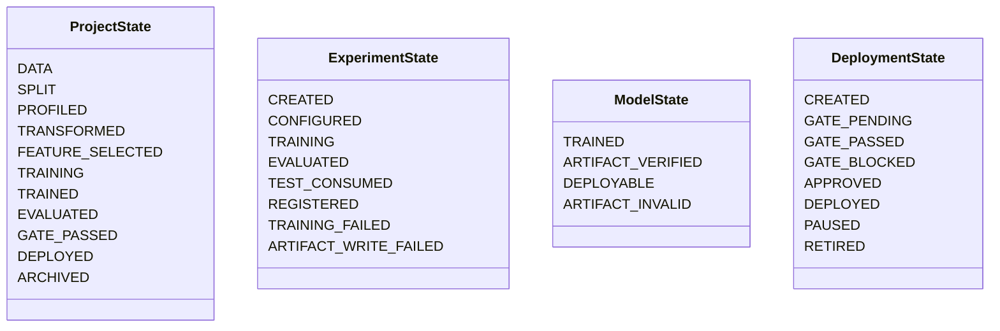
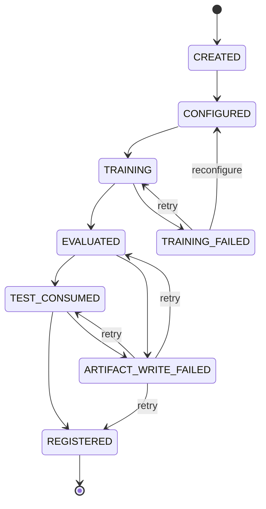
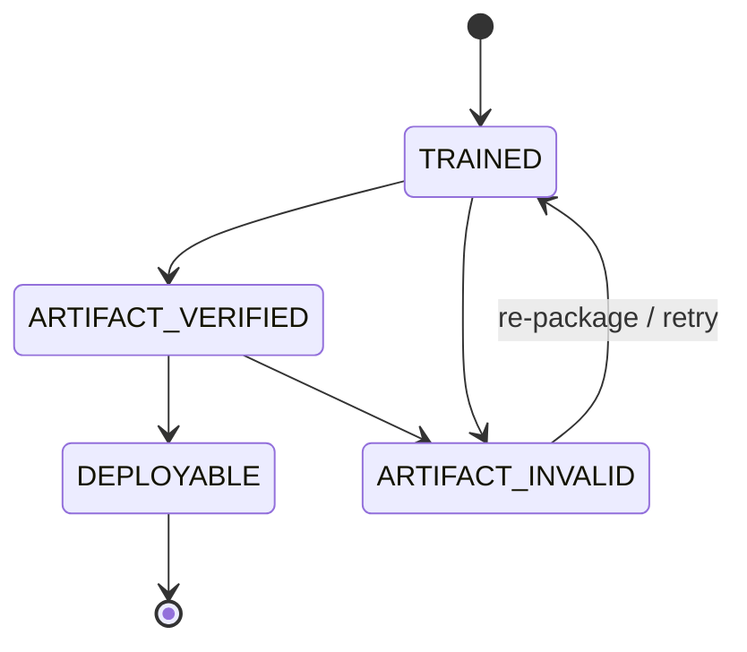
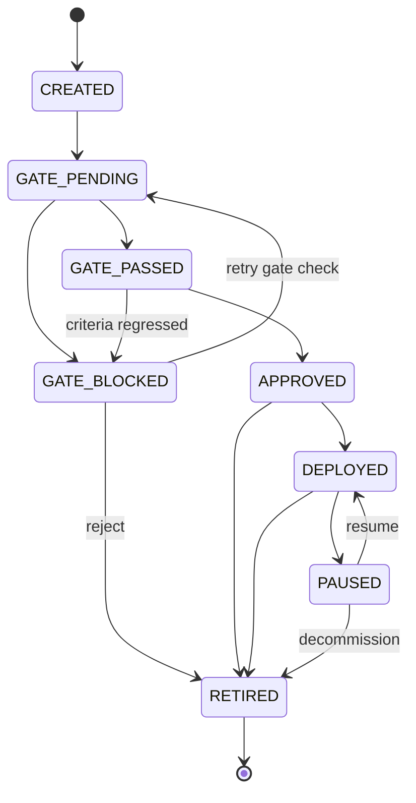

# ML Studio — Architecture & System Contract
### Version: Frozen (SRS v4 / Architecture Contract §8)

This document establishes the frozen system architecture contract, canonical enumerations, data semantics, API protocols, storage structures, and reproducibility boundaries for **ML Studio**. All backend services, repositories, schemas, models, and frontend client components adhere strictly to this contract.

---

## 1. System Invariants & Lifecycle Boundaries

The architecture operates under six non-negotiable invariants:

1. **Strict Preprocessing Isolation:** Imputation, encoding, scaling, and feature selection are fit strictly on training folds within cross-validation. No learned state leaks across folds or to the Development partition root.
2. **Locked Test Partition Sacredness:** The Locked Test partition is evaluated exactly once per experiment generation upon winning model selection. It is never used for tuning, selection, or threshold optimization, and is permanently marked consumed (`TEST_REUSED_DIAGNOSTIC` on reruns).
3. **Environment-Qualified Reproducibility:** Every experiment captures the complete deterministic tuple: `(dataset_content_hash, split_seed, cv_seed, cv_strategy, fold_count, code_version, runtime_libraries)`.
4. **Full Lineage Traceability:** Model $\rightarrow$ Experiment $\rightarrow$ Dataset Version $\rightarrow$ Feature Snapshot $\rightarrow$ Preprocessing Snapshot $\rightarrow$ Evaluation Protocol.
5. **Multi-Condition Deployment Gating:** Deployment requires explicit verification across artifact checksums, frozen performance thresholds, complete lineage, and human sign-off.
6. **Pre-Split Profiling Boundary:** Only structural metadata (file integrity, row/col counts, dtypes) is inspected prior to the outer split. Distributional profiling, outlier detection, and task confidence occur strictly on the Development partition.

---

## 2. Canonical Algorithm Set (`ALGORITHM_SET`)

The core system restricts training to a curated six-algorithm catalog (3 regression + 3 classification) to avoid arbitrary algorithm bloat while ensuring diverse baseline and ensemble coverage:

| Canonical Identifier | Display Name | Task Type | Baseline | Scikit-Learn Class | Purpose & Mechanics |
|---|---|---|---|---|---|
| `linear_regression` | Linear Regression | `REGRESSION` | Yes | `sklearn.linear_model.LinearRegression` | Ordinary least squares baseline |
| `ridge_regression` | Ridge Regression | `REGRESSION` | No | `sklearn.linear_model.Ridge` | L2-regularized linear model |
| `random_forest_regressor` | Random Forest Regressor | `REGRESSION` | No | `sklearn.ensemble.RandomForestRegressor` | Non-linear ensemble bagging regressor |
| `gradient_boosting_regressor`| Gradient Boosting Regressor | `REGRESSION` | No | `sklearn.ensemble.GradientBoostingRegressor` | Stage-wise additive boosting regressor |
| `logistic_regression` | Logistic Regression | `CLASSIFICATION` | Yes | `sklearn.linear_model.LogisticRegression` | Regularized linear classification baseline |
| `random_forest_classifier` | Random Forest Classifier | `CLASSIFICATION` | No | `sklearn.ensemble.RandomForestClassifier` | Non-linear ensemble bagging classifier |
| `gradient_boosting_classifier`| Gradient Boosting Classifier| `CLASSIFICATION` | No | `sklearn.ensemble.GradientBoostingClassifier` | Stage-wise additive boosting classifier |

---

## 3. Feature Selection Defaults & Rank Aggregation

Feature selection executes a four-method rank-aggregation ensemble refit per fold:

```
FEATURE_SELECTION_DEFAULTS:
  strategy:            TOP_K_PERCENT
  alpha:               0.25 (Top 25% of ranked features retained)
  k_min:               5    (Lower feature retention floor)
  k_max:               50   (Upper feature retention ceiling)
  min_applied_methods: 2    (Minimum successful techniques per fold)
```

### Active Core Methods
- `correlation`: Pearson/Spearman absolute correlation with target.
- `lasso`: L1-regularized linear model feature importance ($|\text{coef}|$).
- `random_forest`: Gini impurity / MDI feature importances.
- `permutation`: Permutation importance over out-of-fold predictions.

### Deferred Methods (Post-MVP / Research Track)
- `rfe`: Recursive Feature Elimination.
- `shap`: Kernel/Tree SHAP global importance values.

### Per-Fold Rank Normalization Formula
For $p$ candidate features and technique $T$:
$$r_{j,T} = 1 - \frac{\text{rank}_{j,T} - 1}{p - 1} \quad (p > 1, \text{ ties resolved by average rank})$$
$$\text{EnsembleScore}_j = \frac{1}{|T_{\text{applied}}|} \sum_{T \in T_{\text{applied}}} r_{j,T}$$

---

## 4. Cryptographic Hashing & Dataset Semantics

- **Hashing Algorithm:** `sha256` (Hex-encoded 64-character lowercase digest).
- **Identifier Strategy:** `UUIDv4` for all entity IDs, experiment IDs, snapshot IDs, and correlation trace IDs.
- **Dataset Semantic Model:**
  - `dataset_id`: UUIDv4 representing a logical dataset container entity.
  - `dataset_version_id`: UUIDv4 representing an immutable physical snapshot on disk.
  - `version_number`: Positive integer incremented monotonically per dataset (`1, 2, 3, ...`).
  - `content_hash`: SHA-256 digest computed across raw uploaded stream bytes at ingestion time. Matches trigger deduplication or version flagging.

---

## 5. API Conventions, Timestamps & Pagination

- **API Base Prefix:** `/api/v1`
- **API Version:** `v1` (Semantic version: `1.0.0`)
- **Timestamp Standard:** UTC exclusively. Serialized strictly to ISO-8601 strings: `YYYY-MM-DDTHH:MM:SS.ffffffZ`.
- **Pagination Strategy:** Cursor-based pagination for high-volume endpoints (`datasets`, `experiments`, `models`, `prediction_logs`).

### Cursor Pagination Protocol
```json
{
  "items": [...],
  "next_cursor": "ZXllZEF0XzIwMjYtMDktMDZUMTI6MDA6MDBaLGlkXzkyM2R...",
  "prev_cursor": null,
  "has_more": true,
  "total_count": 42
}
```
- Parameters: `cursor` (opaque base64-encoded token `(created_at, id)`), `limit` (default: 20, min: 1, max: 100).

---

## 6. Canonical Error-Response Envelope (RFC 7807 Compatible)

Every non-2xx response adheres strictly to the single canonical JSON envelope schema:

```json
{
  "error": {
    "code": "RESOURCE_NOT_FOUND",
    "message": "Dataset with ID '9b1deb4d-3b7d-4bad-9bdd-2b0d7b3dcb6d' was not found.",
    "details": [
      {
        "field": "dataset_id",
        "message": "No matching active dataset entity in project",
        "code": "ENTITY_NOT_FOUND"
      }
    ],
    "request_id": "550e8400-e29b-41d4-a716-446655440000",
    "timestamp": "2026-09-06T12:00:00.000000Z"
  }
}
```

### HTTP Status Code Conventions
- `200 OK`: Successful read or update operation.
- `201 Created`: Entity created successfully (representation returned).
- `204 No Content`: Successful deletion / action with empty body.
- `400 Bad Request`: Domain validation failed or illegal parameter combination.
- `401 Unauthorized`: Missing or invalid JWT bearer token.
- `403 Forbidden`: Authenticated user lacks required permission key (`require_permission`).
- `404 Not Found`: Target entity ID not found.
- `409 Conflict`: Resource state conflict (e.g. unique constraint violation, partition reuse attempt).
- `422 Unprocessable Entity`: Request body failed Pydantic schema validation.
- `500 Internal Server Error`: Unhandled server exception.

---

## 7. Authoritative Metric-Naming Strings

### Regression Metrics
| Metric Key | Display Name | Direction | Primary Candidate |
|---|---|---|---|
| `rmse` | Root Mean Squared Error | `MINIMIZE` | **Default Primary** |
| `mae` | Mean Absolute Error | `MINIMIZE` | Alternate Primary |
| `mse` | Mean Squared Error | `MINIMIZE` | Secondary |
| `r2` | Coefficient of Determination ($R^2$) | `MAXIMIZE` | Secondary |
| `adjusted_r2` | Adjusted $R^2$ | `MAXIMIZE` | Secondary |

### Classification Metrics
| Metric Key | Display Name | Direction | Primary Candidate |
|---|---|---|---|
| `macro_f1` | Macro-Averaged F1 Score | `MAXIMIZE` | **Default Primary** |
| `weighted_f1` | Weighted-Averaged F1 Score | `MAXIMIZE` | Alternate Primary |
| `accuracy` | Accuracy | `MAXIMIZE` | Secondary |
| `precision` | Precision (Weighted) | `MAXIMIZE` | Secondary |
| `recall` | Recall (Weighted) | `MAXIMIZE` | Secondary |
| `roc_auc` | ROC-AUC Score (OvR) | `MAXIMIZE` | Secondary |
| `log_loss` | Logarithmic Cross-Entropy Loss | `MINIMIZE` | Secondary |
| `confusion_matrix` | Confusion Matrix Array | N/A | Diagnostic |

---

## 8. Storage Directory Hierarchy & Artifact Naming Scheme

All artifacts are persisted under the root storage volume (`STORAGE_LOCAL_DIR`, default `/data`):

```
/data/
├── datasets/
│   └── {project_id}/
│       └── {dataset_id}_v{version}_{hash_prefix}.{ext}
├── splits/
│   └── {experiment_id}/
│       └── split_indices_{split_type}_{split_seed}.json
├── preprocessors/
│   └── {experiment_id}/
│       └── preprocessor_pipeline_{snapshot_id}.joblib
├── models/
│   └── {experiment_id}/
│       └── model_{model_id}_{algorithm}.joblib
├── reports/
│   └── {experiment_id}/
│       └── evaluation_{split_type}_{model_id}.json
└── shap/
    └── {experiment_id}/
        └── shap_global_{model_id}.joblib
```

---

## 9. Reproducibility Tolerances & Environment Lineage

Numerical floating-point non-determinism across platforms and library micro-versions is bounded by explicitly declared tolerances:

- **Absolute Metric Tolerance:** `1e-3` ($0.001$)
- **Relative Metric Tolerance:** `0.01` ($1.0\%$)

### Mandatory Lineage Keys Captured per Experiment:
1. `dataset_content_hash`: SHA-256 digest of the dataset file.
2. `split_seed`: PRNG seed for Development / Locked Test partitioning.
3. `cv_seed`: PRNG seed for inner cross-validation folds.
4. `cv_strategy`: Fold allocation scheme (`K_FOLD`, `STRATIFIED_K_FOLD`).
5. `fold_count`: Number of cross-validation partitions (default `5`).
6. `code_version`: Git commit SHA at experiment creation.
7. `python_version`: System Python runtime version string.
8. `sklearn_version`: Scikit-learn package version.
9. `numpy_version`: NumPy package version.
10. `pandas_version`: Pandas package version.
11. `model_library_versions`: JSONB map of all associated ML dependency versions.

---

## 10. Entity State Machines (§2, §4)

The system enforces four completely independent, non-overlapping entity state machines across distinct database tables. Status tracking is strictly decoupled—there is never a single shared status column.



### 10.1 Project State Machine (`projects.pipeline_stage`)
Governs the macro-level progression of an end-to-end workbench workspace:

$$\text{DATA} \rightarrow \text{SPLIT} \rightarrow \text{PROFILED} \rightarrow \text{TRANSFORMED} \rightarrow \text{FEATURE\_SELECTED} \rightarrow \text{TRAINING} \rightarrow \text{TRAINED} \rightarrow \text{EVALUATED} \rightarrow \text{GATE\_PASSED} \rightarrow \text{DEPLOYED}$$
*(Any stage can transition to `ARCHIVED`; `ARCHIVED` can reactivate to `DATA`).*

### 10.2 Experiment State Machine (`experiments.status`)
Governs the execution lifecycle, Locked Test consumption, and registry promotion of an experiment run:



### 10.3 Model State Machine (`trained_models.status`)
Governs binary artifact verification against SHA-256 checksums and deployment eligibility:



### 10.4 Deployment State Machine (`deployments.status`)
Governs real-time prediction serving endpoints, multi-condition gate evaluation, stakeholder approvals, and decommissioning:


